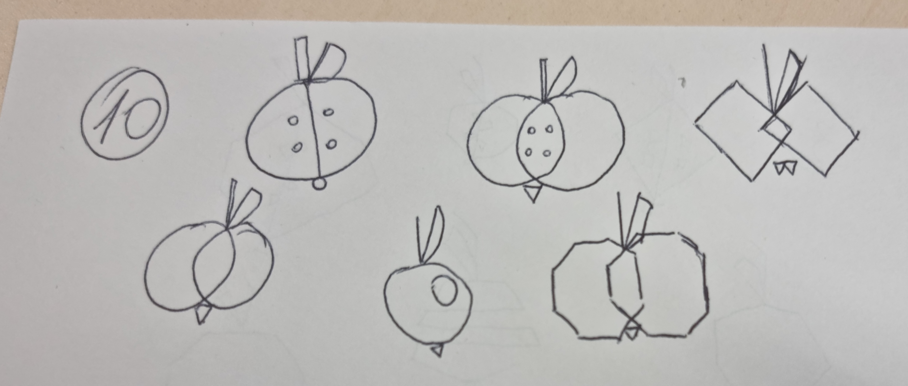
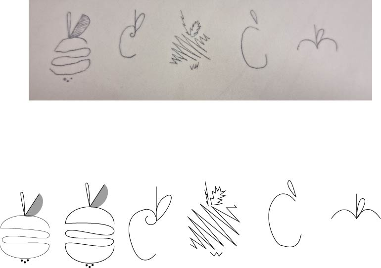
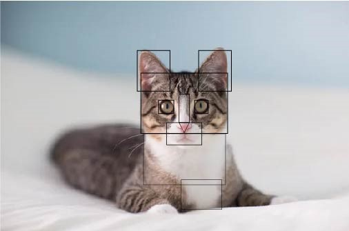
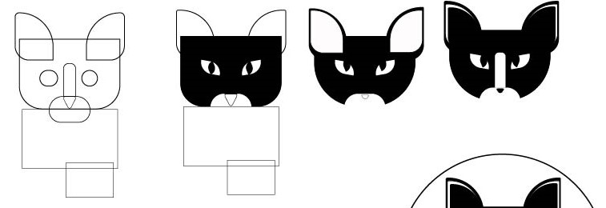
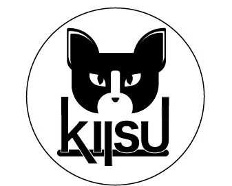

# Tunniteema - Apple logo, visandite ülesanne ja referentspildi järgi kujundamine

Visandasin tunnis käsitsi kiiruse peale erinevat tüüpi õunu. Kokku oli tüüpe 11 ja iga tüübi kohta vähemalt 5 erinevat õuna. See ülesanne oli hea kujutlusvõime arendamise jaoks.   
  

  
Valisin kõikidest õuntest 5 lemmikut ja tegin need illustraatoris üle ja korralikumalt.  
 

## Kassi referentsi järgi kujundamine
Tegin kassi pildi järgi ruutudest (ja ühest kolmnurgast) koosneva kassi.   
    
Modifitseerisin kassi nii, et näeks ilusam ja nunnum välja :)  
Üldiselt värvisin osad kas valgeks või mustaks, pehmendasin nurkasid jne.
  
  
Lisasin sõna "kiisu" sobivas fondis. Lisasin valge äärejoone ja musta kasti alla. Muutsin natuke kerningut. Lisasin kassi ja teksti ümber musta ringi.
  
  
Tõmbasin suu natuke rohkem näo keskele. Direct selection tooliga tõmbasin mõndadelt tähtedelt otsad pikemaks.
 
Lõpptulemus tuli selline välja: 

