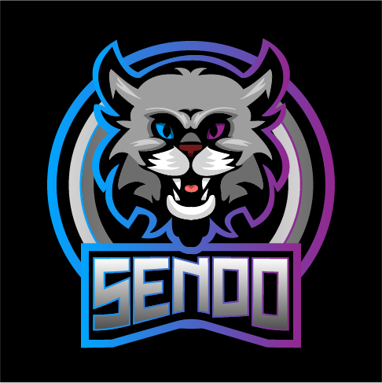

# Tunniteema - kassi ja hundi referentside logod ning vapp
  
## Kass referentsi järgi

 
Alguses tegin kassi järgi geomeetrilised kujundid - ringid, ristkülikud.
 

 
Siis eemaldasin ebavajaliku osa kassi kehast kasutades pathfinderit, et jääks ta saba. Sellega oli natuke raskusi ja pidin mitu korda seda tegema, enne kui lõpuks hakkama sain. Alles praegu märkasin, et ta suu kadus ära vahepeal kuskile.
 

 
Järgmises etapis pöörasin kassi nii, et ta nägu oleks horisontaalselt ekraani suunas. Tegin ta pea ja kõrvad musta värvi, pehmendasin nina pikema osa nurkasid ning lisasin juurde musta nina ringide abil.
 

 
Seejärel pehmendasin kõrvad ja silmade kaks nurka, mis on omavahel horisontaalselt. Lisasin kõrvadele ka valge värvi.
 

 
Pärast seda lisasin kassile pupillid ja värvisin keha mustaks ja äärejooned valgeks. Märkasin, et tegin pathfinderiga valesti saba osa ning pidin uuesti tegema. Võtsin esimesest etapist keha ja tegin uuesti mitu korda, kuni lõpuks välja tuli.
 

 
Värvisin keha täiesti mustaks, ka äärejooned.
 

 
Pehmendasin saba otsa nurki ja lisasin uuesti valged äärejooned, ka näole. Viisin pea natuke lähemale kehale.
 

 
Muutsin natuke kõrvu, peamiselt pehmendasin valgete osade nurgad.
 

### Kassiga sõna tegemine
  

Kasutasin kassi kui "B" tähena. Pöörasin kassi oma originaalsesse suunda, liigutasin saba ta kehale lähemale. Valisin sobiva fondi ja natukene muutsin kerningut.

Seejärel kasutates direct selection tooli tõmbasin tähtedelt "A" ja "Y" otsad pikemaks. Lisasin neile valge äärejoone ja tõmbasin käsitsi kokkupoole, nii, et "A" on kõige ees ja "Y" kõige taga.

Järgmisena pöörasin kassi peegelpilti ja tõmbasin tähtedele lähemale. Tähed tõmbasin ka veel lähemale üksteisele.

Lõpuks pöörasin kassi pea natukene viltu ja  see jäi mu lõpptulemuseks.

## Hunt referentsi järgi
Hunt tuli välja natukene nagu põrsas minu värvivaliku tõttu, aga muidu läks mul isegi hästi sellega. Algul tegin pen tooliga musta osa. Seejärel tegin roosa osa, siis valged ja mustad osad peale. See ei olnud kuigi raske, aga tempo oli kiire, niiet ei saanud eriti ilusasti teha.
 
Uus asi, mis õppisin oli see, kuidas varjusid ja heledamaid kohti lisada. Pen tooliga teha see osa ja võib üleääre minna, ning siis valida mõlemad pen tooliga tehtud osa kui ka roosa osa ja siis alt klahviga vajutades ja shape builder tooliga kustutada üleliigne osa.
 
 

 
### Teised tööd referentsi järgi
Mulle hakkas meeldima see teema ning tegin kodus ise veel kaks tööd referentsi järgi.
 
  
Tegin gaming logo enda tuttavale internetist tuletatud pildiga.
 

 
  
Tegin enda tähtkuju (jäär) inspiratsioonil logo internetist tuletatud pildiga.

