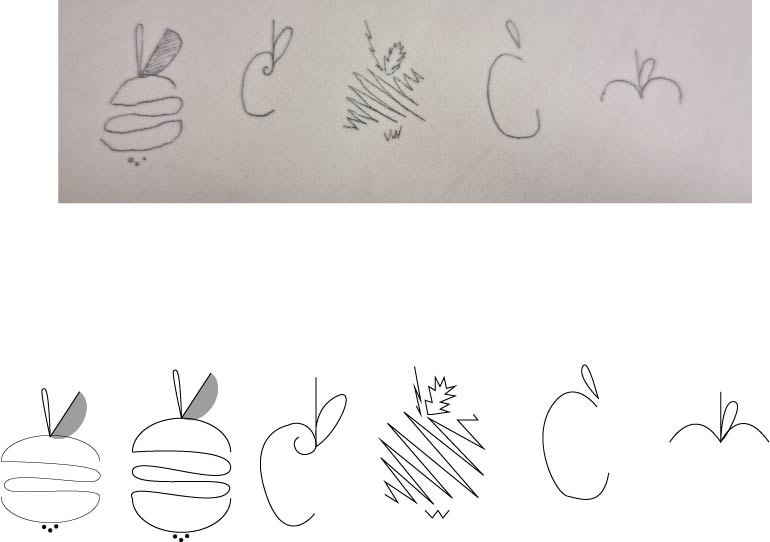
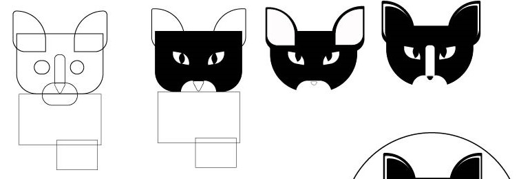
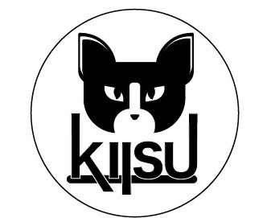

# Tunniteema - Apple logo, visandite ülesanne ja referentspildi järgi kujundamine

Visandasin tunnis käsitsi kiiruse peale erinevat tüüpi õunu. Kokku oli tüüpe 11 ja iga tüübi kohta vähemalt 5 erinevat õuna. See ülesanne oli hea kujutlusvõime arendamise jaoks.   
  

  
Valisin kõikidest õuntest 5 lemmikut ja tegin need illustraatoris üle ja korralikumalt.  
 

Siis tegin kassi pildi järgi ruutudest (ja ühest kolmnurgast) koosneva kassi.   
    
Modifitseerisin kassi nii, et näeks ilusam ja nunnum välja :)  
  
Lõpptulemus tuli selline välja:   

