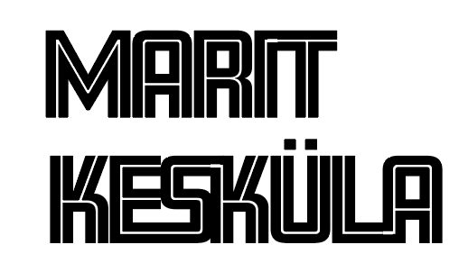

# Tunnusgraafika logiraamat
Esimeses variandis kirjutasin oma nime ja vahetasin kerningut. Viisin oma perekonnanime enda eesnime alla nii, et K täht oleks täpselt M viimase joone all. Tegin nime esitähed mõlemad suuremaks ja paksemaks.

Teises variandis kirjutasin oma nime ja panin perekonnanime eesnime alla. Kasutasin sellist fonti kus tähtede sees on jooned keskel ning ühendasin mõned tähed nii, et panin üksteikse vastu ja rectangle tooliga ühendasin valged jooned üksteisega ja mõned valged kohad kustutasin.

